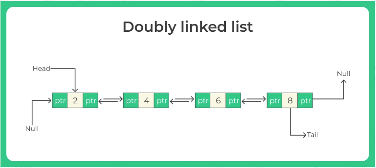

# Doubly Linked List
Doubly Linked List is a variation of Linked list in which navigation is possible in both ways, either forward and backward easily as compared to Single Linked List.

Doubly linked list have the following - 
- **Data**: contains data that is stored.
- **Pointer (next)** – Contains the address of the next node in the doubly linked list.
- **Pointer (previous)** – Contains the address of the previous node in the doubly linked list



# Structure doubly linked list

```typescript
export class DoublyLinkedListNode<T> {
    constructor(
        public data: T,
        public next?: DoublyLinkedListNode<T>,
        public prev?: DoublyLinkedListNode<T>
    ) {}
}
```

```typescript
class DoublyLinkedList<T> implements ILinkedList<T> {
    private head?: DoublyLinkedListNode<T> | undefined;
    private tail?: DoublyLinkedListNode<T> | undefined;
    private size: number;

    constructor() {
        this.head = undefined;
        this.tail = undefined;
        this.size = 0;
    }
}
```
# Method of doubly linked list

```typescript
interface ILinkedList<T> {
    isEmpty(): boolean;
    get(index: number): T | null | undefined;
    push(data: T): void;
    pop(): T | undefined;
    append(data: T): void;
    remove(): T | undefined;
    insertAt(index: number, data: T): void;
    removeAt(index: number): T | undefined;
    clear(): void;
    toArray(): (T | undefined)[];
    length(): number;
}
```

## Get
Returns the element at the specified position in this list.

```typescript
get(index: number): T | null {
    if(index < 0 || index >= this.size) {
        return null;
    }
    let currentNode: DoublyLinkedListNode<T> | undefined = this.head;
    for(let i: number = 0; i < index; i++) {
        currentNode = currentNode?.next;
    }
    return currentNode?.data ?? null;
}
```

## Push 
Inserts the given data as the first node of the list.
```typescript
push(data: T): void {
    const newNode: DoublyLinkedListNode<T> = new DoublyLinkedListNode<T>(data);
    if(!this.head) {
        this.head = newNode;
        this.tail = newNode;
    } else {
        this.head.prev = newNode;
        newNode.next = this.head;
        this.head = newNode;
    }
    this.size++;
}
```

## Pop 
Removes a node from the head of the list.
```typescript
pop(): T | undefined {
    if(!this.head) {
        throw new Error("Index out of bounds");
    }   
    const removedNode = this.head;
    if(this.head === this.tail) {
        this.tail = undefined;
    } else {
        this.head.next!.prev = undefined;
    }
    this.head = this.head.next;
    this.size--;
    return removedNode.data;
}
```

## Append
Inserts a node at the tail of the list.
```typescript
append(data: T): void {
    const newNode: DoublyLinkedListNode<T> = new DoublyLinkedListNode<T>(data);
    if(!this.head) {
        this.head = newNode;
    } else {
        this.tail!.next = newNode;
        newNode.prev = this.tail;
    }
    this.tail = newNode;
    this.size++;
}
```

## Remove
Removes a node from the tail of the list.
```typescript
remove(): T | undefined {
    if(!this.head) {
        throw new Error("Index out of bounds");
    }
    const removedNode = this.tail;
    if (this.head === this.tail) {
        this.head = undefined;
    } else {
        this.tail!.prev!.next = undefined;
    }
    this.tail = this.tail!.prev;
    this.size--;
    return removedNode!.data;
}
```

## InsertAt
Inserts a node at a specific index.
```typescript
insertAt(index: number, data: T): void {
    if (index < 0 || index > this.size) {
        throw new Error("Index out of bounds");
    }
    if (index === 0) {
        this.push(data);
        return;
    }
    if (index === this.size) {
        this.append(data);
        return;
    }
    const newNode = new DoublyLinkedListNode(data);
    let prevNode: DoublyLinkedListNode<T> | undefined = this.head;
    for (let i: number = 0; i < index - 1; i++) {
        prevNode = prevNode?.next;
    }
    const nextNode = prevNode?.next;
    prevNode!.next = newNode;
    newNode.prev = prevNode;
    newNode.next = nextNode;
    nextNode!.prev = newNode;
    this.size++;
}
```

## RemoveAt
Removes a node at a specific index.
```typescript
removeAt(index: number): T | undefined {
    if (index < 0 || index >= this.size) {
        throw new Error("Index out of bounds");
    }
    if (index === 0) {
        return this.pop();
    }
    if (index === this.size - 1) {
        return this.remove();
    }
    let removedNode: DoublyLinkedListNode<T> | undefined = this.head;
    for (let i: number = 0; i < index; i++) {
        removedNode = removedNode?.next;
    }
    removedNode!.prev!.next = removedNode!.next;
    removedNode!.next!.prev = removedNode!.prev;
    this.size--;
    return removedNode!.data;
}
```

### Clear
Clear the linked list

```typescript
clear(): void {
    this.head = undefined;
    this.tail = undefined;
    this.size = 0;
}
```

### ToArray
Converts the list to an array.x

```typescript
toArray(): T[] {
    const array: T[] = [];
    let currentNode: DoublyLinkedListNode<T> | undefined = this.head;
    while (currentNode) {
        array.push(currentNode.data);
        currentNode = currentNode.next;
    }
    return array;
}
```

### IsEmpty
Returns true if the list is empty.

```typescript
isEmpty(): boolean {
    return this.size === 0;
}
```

### Length
Return length of the linked list.

```typescript
length(): number {
    return this.size;
}
```

### Reverse
Reverses the linked list.
```typescript
reverse(): DoublyLinkedList<T> | null {
    if (!this.head) {
        return null;
    }
    let currentNode: DoublyLinkedListNode<T> | undefined = this.head;
    let nextNode: DoublyLinkedListNode<T> | undefined = undefined;
    let prevNode: DoublyLinkedListNode<T> | undefined = undefined;
    while (currentNode) {
        nextNode = currentNode.next;
        prevNode = currentNode.prev;

        currentNode.next = prevNode;
        currentNode.prev = nextNode;

        prevNode = currentNode;
        currentNode = nextNode;
    }
    this.tail = this.head;
    this.head = prevNode;
    return this;
}
```

# How to run test

```
npm test src/data-structures/linked-list/singly-linked-list
```
