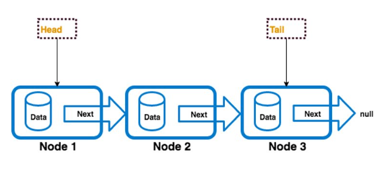

# What is a singly linked list?

A singly linked list is a data structure that consists of a head, tail, and length property. The head and tail are assigned a node object. The singly-linked list can only be traverse in one direction. Starting at the head and ending at the tail.



# How to build singly linked list?

To get started building a singly linked list we first need to create 2 classes and 1 interface. The first class will create node objects which contain a value and a next property. The second class is the singly linked list which contains a head, tail, and size(length), an interface contains the method of linked lists. When we first instantiate a singly linked list a new node is created and is set to the head and tail properties of the linked list.

```typescript
class SinglyLinkedListNode<T> {
    constructor(public data: T, public next?: SinglyLinkedListNode<T>) {}
}
```

```typescript
interface ILinkedList<T> {
    isEmpty(): boolean;
    get(index: number): T | null | undefined;
    push(data: T): void;
    pop(): T | undefined;
    append(data: T): void;
    remove(): T | undefined;
    insertAt(index: number, data: T): void;
    removeAt(index: number): T | undefined;
    clear(): void;
    toArray(): (T | undefined)[];
    length(): number;
}
```

```typescript
class SinglyLinkedList<T> implements ILinkedList<T> {
    private head?: SinglyLinkedListNode<T>;
    private tail?: SinglyLinkedListNode<T>;
    private size: number;

    constructor() {
        this.head = undefined;
        this.tail = undefined;
        this.size = 0;
    }
}
```

## Get
Returns the element at the specified position in this list. Return null if linked list is empty or index < 0 or index >= size of linked list, use loop to find the node corresponding to the input index, return the corresponding node value

```typescript
get(index: number): T | null | undefined {
    if(index < 0 || index >= this.size) {
        return null;
    }
    if(this.isEmpty()) {
        return null;
    }
    let currentNode: SinglyLinkedListNode<T> = this.head!;
    for(let i: number = 0; i < index; i++) {
        if(!currentNode.next) {
            return null;
        }
        currentNode = currentNode.next;
    }
    return currentNode.data;
}
```

## Push 
Inserts the given data as the first node of the list. Initialize a new node with the input value, if the linked list is empty, assign head and tail to be the new node, otherwise update the new node's next pointer to be head and head to be the new node. Increase the size by one unit.

```typescript
push(data: T): void {
    const newNode: SinglyLinkedListNode<T> = new SinglyLinkedListNode<T>(data);
    if (this.isEmpty()) {
        this.head = newNode;
        this.tail = newNode;
    } else {
        newNode.next = this.head;
        this.head = newNode;
    }
    this.size++;
}
```

## Pop 
Removes the first node of the list. Returns error if the linked list is empty, assigns the next node to head, reduces the size of the linked list by one, and returns head with the link removed.

```typescript
pop(): T | undefined {
    if(this.isEmpty()) {
        throw new Error("Index out of bounds");
    }
    const node: SinglyLinkedListNode<T> = this.head!;
    this.head = this.head!.next;
    this.size--;
    return node.data;
}
```

## Append
Inserts the given data as a new node after the current tail. Initialize a new node with the value received from the input parameter. If the linked list is empty, assign head and tail to be the new node, otherwise assign the next node of the current tail to be new node and assign tail to new node.

```typescript
append(data: T): void {
    const newNode: SinglyLinkedListNode<T> = new SinglyLinkedListNode<T>(data);
    if(this.isEmpty()) {
        this.head = newNode;
    }else {
        this.tail!.next = newNode;
    }
    this.tail = newNode;
    this.size++;
}
```

## Remove
Removes the current tail of the list. Return error if linked list is empty, initialize variable currentTail to store current tail node, if linked list has only one node then assign head & tail to undefined and reduce size by one unit, return currentTail value, if linked list many nodes, find node near the end by looping from head until head.next differs from currentTail, then assign tail the node adjacent to tail and reduce the linked list by one size, return currentTail value

```typescript
remove(): T  {
    if(!this.head) {
        throw new Error("Index out of bounds")
    }
    const currentTail = this.tail;
    // There is only one node in linked list.
    if(this.head === this.tail) {
        this.head = undefined;
        this.tail = undefined;
        this.size--;
        return currentTail!.data;
    }
    // There are many nodes in linked list.
    let currentNode: SinglyLinkedListNode<T> = this.head;
    while (currentNode.next !== currentTail) {
        currentNode = currentNode.next!;
    }
    this.tail = currentNode;
    this.size--;
    return currentTail!.data;
}
```

## InsertAt
Inserts the data as a new node at the given index. If index < 0 & index >= size return error, If index = 0 then insert data as the first node of the list, If index = size then insert data as a new node after the current tail. If not the above cases, initialize new node with data from input, find current node corresponding to index from input, initialize next node as next node of current node, then assign current node's next node as new node , assign the next node of the new node to be the next node, increasing the size by one.

```typescript
insertAt(index: number, data: T): void {
    if(index < 0 || index >= this.size) {
        throw new Error("Index out of bounds");
    }
    if(index === 0) {
        this.push(data);
        return;
    }
    if(index === this.size) {
        this.append(data);
        return;
    }
    const newNode: SinglyLinkedListNode<T> = new SinglyLinkedListNode<T>(data);
    let currentNode: SinglyLinkedListNode<T> | undefined = this.head;
    for(let i: number = 0; i < index - 1; i++) {
        currentNode = currentNode?.next;
    }
    const nextNode = currentNode?.next;
    currentNode!.next = newNode;
    newNode.next = nextNode;
    this.size++;
}
```

## RemoveAt
Removes the node at the given index. If index < 0 & index >= size return error, If index = 0 then remove the first node of the list, If index = size then remove current tail of the list. If not the above cases, find previousnode, currentNode corresponding to the index from the input, then break the link between previousnode and currentNode by giving previousnode.next = currentNode .next.

```typescript
removeAt(index: number): T | undefined {
    if(index < 0 || index >= this.size) {
        throw new Error("Index out of bounds");
    }
    if(index === 0) {
        return this.pop();
    }
    if(index === this.size - 1) {
        return this.remove();
    }
    let previousNode: SinglyLinkedListNode<T> | undefined;
    let currentNode: SinglyLinkedListNode<T> | undefined = this.head;
    for(let i: number = 0; i < index; i++) {
        if(i === index - 1) {
            previousNode = currentNode;
        }
        currentNode = currentNode?.next;
    }
    previousNode!.next = currentNode?.next;
    this.size--;
    return currentNode!.data;
}
```

### Clear
Clear the linked list

```typescript
clear(): void {
    this.head = undefined;
    this.tail = undefined;
    this.size = 0;
}
```

### ToArray
Converts the list to an array

```typescript
toArray(): (T | undefined)[] {
    const array: T[] = [];
    let currentNode: SinglyLinkedListNode<T> | undefined = this.head;
    while(currentNode) {
        array.push(currentNode.data);
        currentNode = currentNode.next;
    }
    return array;
}
```

### IsEmpty
Returns true if the list is empty.

```typescript
isEmpty(): boolean {
    return this.size === 0;
}
```

### Length
Return length of the linked list.

```typescript
length(): number {
    return this.size;
}
```

# How to run test singly linked list

```
npm test src/data-structures/linked-list/test/singly-linked-list.test.ts
```
